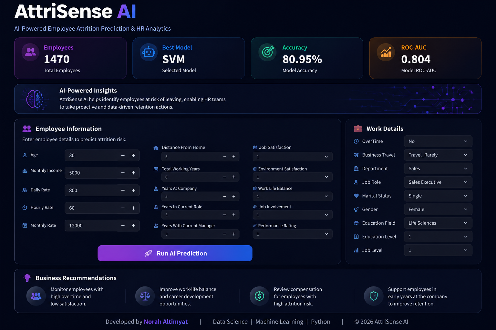

# AttriSense AI

### AI-Powered Employee Attrition Prediction & HR Analytics

AttriSense AI is a machine learning web application designed to predict employee attrition risk using HR analytics data. The project combines data preprocessing, machine learning, model evaluation, and an interactive Streamlit dashboard to support data-driven employee retention decisions.

---

## Dashboard Preview



---
## Live Demo

🚀 Try the app here:  
https://attrisense-ai-norahds.streamlit.app

## Project Overview

Employee attrition is a major challenge for organizations because losing employees can increase hiring costs, reduce productivity, and affect team stability.

This project predicts whether an employee is likely to leave the company based on HR-related features such as monthly income, overtime, job satisfaction, work-life balance, department, job role, and years at the company.

---

## Key Features

* Interactive Streamlit dashboard
* Employee attrition risk prediction
* Risk probability estimation
* HR-focused business recommendations
* Machine learning model comparison
* Clean and modern user interface

---

## Machine Learning Workflow

```text
Raw Dataset
→ Data Cleaning
→ Exploratory Data Analysis
→ One-Hot Encoding
→ Feature Scaling
→ Model Training
→ Model Evaluation
→ Streamlit Web App
```

---

## Dataset

The project uses the IBM HR Employee Attrition dataset.

| Item              |     Value |
| ----------------- | --------: |
| Employees         |      1470 |
| Features          |        35 |
| Target Variable   | Attrition |
| Missing Values    |         0 |
| Duplicate Records |         0 |

---

## Models Evaluated

| Model                        | Accuracy | Recall | F1 Score | ROC-AUC |
| ---------------------------- | -------: | -----: | -------: | ------: |
| Logistic Regression          |   75.17% | 76.60% |    0.497 |   0.807 |
| Support Vector Machine (SVM) |   80.95% | 59.57% |    0.500 |   0.804 |
| Random Forest                |   83.33% | 34.04% |    0.395 |   0.786 |

SVM was selected as the final model because it provided the best balance between accuracy, F1 score, and generalization performance for this application.

---

## Technologies Used

* Python
* Pandas
* Scikit-learn
* Streamlit
* Pickle

---

## Project Structure

```text
AttriSense-AI/
│
├── app.py
├── dashboard.png
├── model.pkl
├── scaler.pkl
├── columns.pkl
├── requirements.txt
└── README.md
```

---

## How to Run Locally

Install the required libraries:

```bash
pip install -r requirements.txt
```

Run the Streamlit application:

```bash
streamlit run app.py
```

---

## Business Value

AttriSense AI helps HR teams:

* Identify employees at high risk of leaving
* Support proactive retention strategies
* Improve workforce planning
* Reduce turnover-related costs
* Make data-driven HR decisions

---

## Future Improvements

* Add SHAP explainability
* Apply hyperparameter tuning
* Test advanced models such as XGBoost
* Add more HR analytics visualizations
* Deploy the application on Streamlit Cloud

---

## Author

**Norah Altimyat**
Data Science | Machine Learning | Python

---

## Copyright

© 2026 Norah Altimyat. All rights reserved.

This project is provided for portfolio and educational purposes only.

Unauthorized copying, redistribution, modification, or commercial use of this project, in whole or in part, is prohibited without prior written permission from the author.
